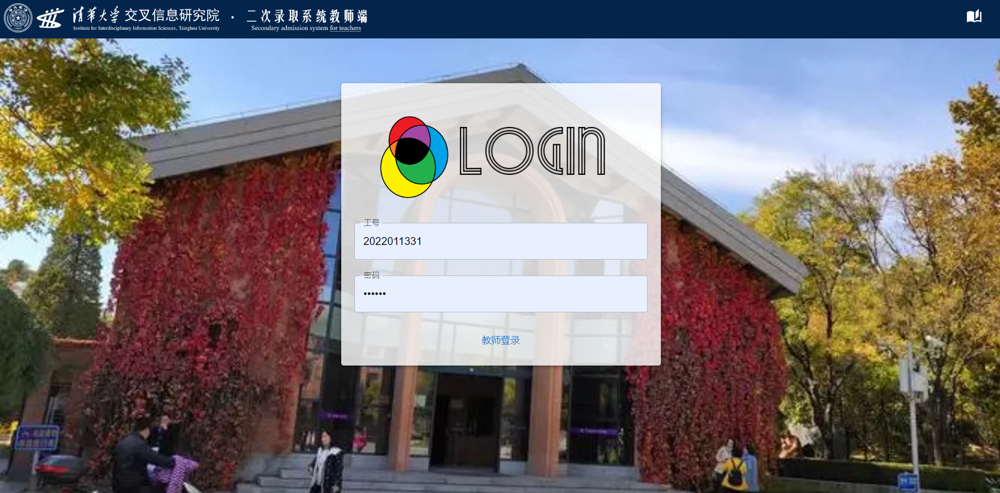

# 叉院二招系统

.png)

## 项目情况

### 组别
第15组（组名211A）
### 参与人员及贡献
陈树伦（2022011325）：TODO

黄文杰（2022011327）：TODO

陈梓青（2022011335）：通过同文系统架设早期框架，并参与完成了前端尤其是界面设计部分的工作。

### 项目进度
开始日期：2023.6.25 截止日期：2023.7.16 目前状态：已完工

## 系统使用说明

本系统为交叉信息研究院二招设计，用户可以以教师或学生的身份登入系统，彼此交互并满足二招时填写资料，收发消息，考试评价等需求。系统分为教师端和学生端。

### 学生端

学生端为学生提供服务，是二招系统对外公开的部分。学生端的服务主要包括学生注册，学生登录，查看通知，参与考试，查看成绩与通过情况等。

#### 学生登录界面

此界面供已注册的学生通过学号密码登入。若学生填入的学号密码与数据库匹配，则将自动转到学生主页。尚未注册的学生可根据指引转到学生注册界面。在二次招生的现场，或与二招相关的活动中，可为学生提供此页面链接或包含此链接的二维码。

点击右上角的书籍图标，即可跳转到交叉信息研究院官网，此功能在主要页面中均有保留。

#### 学生注册界面

此界面供学生注册信息。按照学院招生方面的要求，学生应提供较为详尽的个人信息，并且一经注册，不得修改。遵从系统引导输入合法信息后确认注册，学生可根据该学号登入系统，初始密码为123456。

#### 学生主页面

登入后，学生即可进入主页。主页的主体部分为通知列表，只呈现学生有资格查看的通知标题。靠左上角标有“latest news”图章标记，指明顶端为最新消息。点击标题，logo亮起，消息展开为完全体，展现内容，通知发送人及发送时间。当通知较多时，界面自动转为下拉列表，允许用户下拉查看全部消息。

主页右手边有一处信笺，展示笔试和面试的开始时间。其下为用户提供了参加笔试和查看成绩两个功能。在笔试的进行时间内，点击参加笔试进入学生考试界面。点击查看成绩，则显示学生目前成绩单。

右上角的欢迎字样与账户信息相关。将鼠标悬停其上，欢迎字样分为两处，展示查看个人信息和登出两个账户功能。点击即可进入相关界面。

#### 个人信息界面

由主页通过账户中查看信息进入此界面。此页面展示用户注册时填写的部分用户信息。应学院要求，此部分信息不得修改。由此页面可进一步转到修改密码界面。可转回学生主页。

#### 修改密码界面

此页面用户可以对密码加以修改。需输入原密码并连续两次键入相同的修改后密码，确认后即可完成修改。可转回学生主页。

#### 学生笔试界面
此界面供学生参加线上笔试使用。在考试题目发布后，学生可看到题目并加以作答。题目分为选择题和主观性题目（填空，解答等）两类。初始仅呈现题号，类别及分数，点击题目展开为完全体。作答后答案会被记录，完成全部题目后，在考试结束前，点击右上方提交按钮即可成功上传答案。可转回学生主页。

### 教师端
教师端为系统管理端，较学生端拥有管理学生，创建消息，上传题目，批改赋分等额外功能。应注意，学生端已有的功能在教师端均加以合理的保留，这里不予额外介绍。

#### 教师登录

教师登录要求教师提供工号与密码，与数据库匹配通过即可进入主页。然而不同于学生端，教师无法自行注册，需由管理员先行录入。

#### 管理员界面

管理员通过教师登录界面认证进入，需在工号栏填写“admin”并填写专有密码（目前为“c3Vkb2Vy”）进入管理员界面。管理员界面可填写教师信息注册教师，初始密码为123456。

#### 教师主页

登入后，教师即可进入主页。主页的主体部分为通知列表，与学生端相同。教师可查看全部信息。

主页右手边同样有一处信笺，除展示笔试和面试的开始时间外，为用户提供了查看全部学生信息，发布新通知，更改考试信息，笔试命题，笔试阅卷和查看帮助六个管理功能。查看帮助介绍了其他功能的作用和使用方式。应注意，教师功能往往与数据库直接相连，若出现任何功能执行后效果未显现或未完成加载，切莫直接重启页面（会丢失Token）。请退回主页后再进入即可看到完整效果。

#### 发布通知界面

此界面由教师主页进入，供教师发布新通知。教师依次指定通知题目，内容，是否只对通过笔试学生开放，是否只对通过面试学生开放四项，随后即可发布通知。可返回主页查看。

#### 查看全部学生信息

此界面由教师主页进入，供教师查看学生信息。学生基本信息以列表形式呈现，老师可点击更改成绩按钮为其赋予成绩。根据成绩和考试通过方式（考试信息中设置），系统会自动判断其是否通过考试。教师可进一步查看个人全部信息，即可收到该学生注册时填写的全部信息。

#### 管理考试界面

此界面由教师主页进入，供教师管理考试信息。考试信息分为笔试和面试两项，老师可更改相应考试的起止时间，成绩公布时间，通过人数或通过分数五项属性。应注意，通过人数与方式指定一项后，另一项自动变为未指定。

#### 笔试命题

此页面由教师主页进入，供教师查看并管理线上笔试题目。由右上角添加按钮创建新题目即可新建题目。对现有题目可点击查看其完整内容和参考答案，选择删除即可删除现有题目。

#### 笔试阅卷
此页面由教师主页进入，供教师判卷。选择指定学生后（此处为匿名，教师仅能看到对应学号），教师可查看其试卷，附有参考答案并自动批改其选择题部分。据此教师可为其笔试评分。

## 设计理念

### 界面设计

本部分介绍由陈梓青完成

#### LOGO

对于一个成熟的系统来说，一个鲜明可辨认且与主题关联度高的logo非常有必要。本系统logo名为“三生万物”，采用了黄文杰大师极有个人艺术风格的写意作品，获得了作者的独立授权，有彩色和黑白两版。

logo的主体部分由Venn Diagram形式的三个圆两两相交组成，圆即是元，三元对应计算机科学，人工智能和量子信息三大方向。三元两两相交，对应学院学科交叉的宗旨。此外，下面两圆还分别表示参加高考和竞赛的学生，上方的第三圆表示院，代表交叉信息院，通过一招和与二圆均相交部分所代表的的二招，不论出身的接纳选拔杰出的人才，最终形成了交叉信息研究院丰富的人才结构。上色时强化圆到元的联想，采用三原色及其混合带来的多彩图案，在表示叉院生活丰富前途多彩的同时，也象征着学科交叉理念所带来的多彩的前景。

在使用logo时，我们不拘于将其视为静态元素或简单的标签，还融入到页面构图和功能搭建中。例如学生和教师的主页里的通知，在未打开时是黑白的，展开全部内容后转为彩色，同时起到了标签、装饰和提示钮的多重效果。

#### 异同设计

在如何处理不同界面间的共性与区别，我们组也有一套完整的理念。即布局同构化和元素区分化。

所谓布局同构化，是指两个界面如果功能有相似处，那么相似功能也应以同一形式布局在同一位置。例如所有界面的跳转学院官网按钮，均用文献索引的IconButton布局在左上角，而所有信息界面的确认和返回按钮，都被类似地布局在信息下部。这类设计，会让用户对系统的布局迅速产生熟悉感，降低用户的学习成本，令不了解此系统的人也能迅速上手。

所谓元素区分化，是指即便布局接近的两个页面，甚至尤其是对于越接近的两个页面，越要将一些元素加以区分。例如，对于学生和教师端数十个关键页面，我们全部使用有区分度的不同背景，学生与教师端的上方条幅，也采用了色彩迥异的紫色和深蓝加以区分。这类设计，一方面防止用户混淆界面，产生误操作；同时加大跳转页面带来的视觉反馈，防止审美疲劳。

#### 风格设计

页面的风格设计方面，我们把页面用途作为第一因素。通知系统日常使用，需要反复查看，所以我们对学生主页进行了深度的装饰，使页面更加和谐而优雅。新同学们对考试成绩公布的权威性非常关心，我们便在成绩栏添加防伪章（目前为组章）为同学们打消疑虑。而考试作为紧张严肃的场合，我们刻意减少了装饰性图案，并放弃了页面半透明这一贯穿全页面设计的手法，保证同学的作答体验不会被装饰喧宾夺主。

#### 细节设计
.jpg>)
萨特说：“魔鬼的魅力在于细节。”在页面设计里，我们不轻视任何可能提升用户体验的细节。消息列表采用顶部为最新消息，为防止用户误解顺序，我们制作了提示标记加以区分。教师功能繁多，且操作后果重大，我们便设计了帮助按钮。只要能带来使用体验上的提升，我们不放弃任何细节上的打磨。

TODO:等完全做好补一下截图